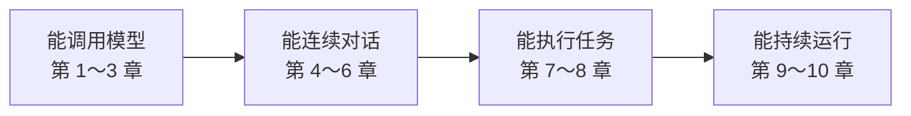

这组文章参考 pi 的真实实现，但不按源码目录逐层讲解。学习路线从一个可以运行的模型调用开始，每章只增加一项可以观察的能力，最后组成一个能对话、能执行工具并能长期运行的 Agent。

涉及的两个核心包是：

- `@earendil-works/pi-ai`：连接模型并统一消息和事件；
- `@earendil-works/pi-agent-core`：推进对话、执行工具和维护状态。

## 整个系列会得到什么

这不是组件清单，而是读者逐步获得的能力：先调用模型，再看到并保存回复，然后让 Agent 执行工具，最后解决会话恢复和上下文过长的问题。

## 第一阶段：能调用模型

| 章 | 本章只解决什么 | 学完可以做什么 |
|---|---|---|
| [1. 定义一次模型调用](../01-unified-contract/) | 固定一次调用的输入和输出 | 用 `Model` 和 `Context` 得到一条模型消息 |
| [2. 选择并调用不同模型服务](../02-provider-routing/) | 隔离服务选择和认证差异 | 使用同一个入口切换不同 Provider |
| [3. 接入阿里云百炼](../03-bailian-provider/) | 用现有协议适配器组装百炼 Provider | 完成一次真实百炼模型请求 |

读完这一阶段，调用方不需要直接依赖某家厂商 SDK。

## 第二阶段：能连续对话

| 章 | 本章只解决什么 | 学完可以做什么 |
|---|---|---|
| 4. 让模型回复逐字显示 | 把文本分片立即交给界面 | 用户无需等待完整回复 |
| 5. 让事件流同时提供过程和结果 | 协调事件迭代和最终消息 | UI 读取增量，Agent 等待完整结果 |
| 6. 保存消息并连续对话 | 把上一轮消息加入下一次请求 | Agent 能记住当前会话内容 |

读完这一阶段，Agent 已经可以流式显示并进行多轮对话。

## 第三阶段：能执行任务

| 章 | 本章只解决什么 | 学完可以做什么 |
|---|---|---|
| 7. 让 Agent 调用工具 | 根据模型返回的工具请求继续主循环 | Agent 从“回答”变成“行动” |
| 8. 解析并校验工具参数 | 处理参数分片和不可信输入 | 只有通过校验的参数才能执行 |

读完这一阶段，Agent 可以安全地把模型输出变成工具操作。

## 第四阶段：能持续运行

| 章 | 本章只解决什么 | 学完可以做什么 |
|---|---|---|
| 9. 保存并恢复会话 | 把任务过程持久化到磁盘 | 进程退出后可以继续任务 |
| 10. 压缩过长的上下文 | 用摘要替换过长历史，并恢复临时失败 | 长任务不会轻易超过上下文窗口 |

摘要请求的退避重试属于第 10 章，因为它恢复的是上下文压缩流程，而不是工具参数错误。

## 每章如何组织

每章遵循同一顺序：

1. 从一个可以观察的问题开始；
2. 用一张简单总览图说明本章处于哪条流程；
3. 只讲解决该问题所需的主调用链；
4. 运行一个最小 Lab，先看到结果；
5. 最后补充必要的实现边界。

队列、缓存、修复算法和厂商兼容分支只有在影响本章结果时才进入正文。完整示例放在 `labs/`，正文保留解释机制所需的核心代码。

## 本站收录进度

- 已收录：本篇总览、[第 1 章：定义一次模型调用](../01-unified-contract/)、[第 2 章：选择并调用不同模型服务](../02-provider-routing/)、[第 3 章：接入阿里云百炼](../03-bailian-provider/)
- 第 4～10 章尚未收录，待更新，后续按章节顺序更新。

推荐先阅读总览，再进入第 1 章。

