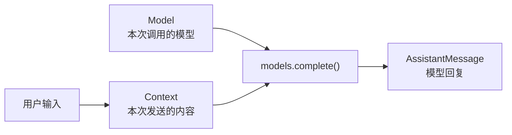

本章只完成一件事：通过 `models.complete()` 提交固定结构的输入，并得到固定结构的回复。完成后，调用方只需要认识 `Model`、`Context` 和 `AssistantMessage`。

## 总览：一次调用有哪些输入和输出



先记住这条关系：`Model` 决定调用谁，`Context` 决定发送什么，`AssistantMessage` 保存返回结果。

## 1. 先确定调用方式

我们希望上层只写下面这段代码：

```ts
const reply = await models.complete(model, context);
```

`models` 是 pi 提供的统一调用入口。`complete()` 的两个输入职责不同：

- `model` 指定这次调用使用哪个模型；
- `context` 保存本次发送的消息；
- 返回的 `reply` 是一条新的模型消息，不修改原始输入。

## 2. Context 保存本次发送的内容

`Context` 是一次模型请求能看到的内容。真实类型还包含其他字段，下面只摘出本章使用的 `messages`：

```ts
interface Context {
	messages: Message[];
}
```

`Message` 表示一条消息。本章只构造一条用户消息，不展开其他消息形态。

本章先只使用一条用户消息：

```ts
const context: Context = {
	messages: [{ role: "user", content: "hello", timestamp: Date.now() }],
};
```

这条用户消息包含角色、正文和创建时间。本章的调用只需要读取正文 `hello`。

模型选择信息不放进 `Context`。这样模型和本次发送的内容各自保持清晰。

## 3. Model 指定本次调用的模型

pi 用普通数据描述模型。下面只保留本章需要的一个字段：

```ts
interface Model {
	id: string;
}
```

`id` 是本次调用使用的模型名称。

## 4. AssistantMessage 保存调用结果

模型回复不是直接返回一个字符串，而是返回一条消息。下面是从真实类型中裁剪出的本章视图，不是完整的 `AssistantMessage` 定义：

```ts
interface TextContent {
	type: "text";
	text: string;
}

interface AssistantMessage {
	role: "assistant";
	content: TextContent[];
	stopReason: "stop";
}
```

本章只处理文本内容：

```ts
{
	role: "assistant",
	content: [{ type: "text", text: "hello" }],
	stopReason: "stop",
}
```

本章的 `content` 中只有文本块，调用方从中读取模型生成的文字。`stopReason: "stop"` 表示这次调用正常结束。

## 5. 把三个对象连起来

下面用一个教学替身验证数据如何流动。它保留真实的 `models.complete(model, context)` 调用形式，只省略网络请求和返回消息中本章不读取的字段：

```ts
const models = {
	async complete(model: Model, context: Context): Promise<AssistantMessage> {
		const prompt = context.messages.at(-1)?.content ?? "";
		return {
			role: "assistant",
			content: [{ type: "text", text: `${model.id}: ${prompt}` }],
			stopReason: "stop",
		};
	},
};
```

调用过程可以压缩为：

```text
Model(demo-model) + Context(hello)
                ↓ models.complete()
AssistantMessage(demo-model: hello)
```

这里使用教学替身，只验证统一入口、输入和输出如何配合。

## 6. 运行本章示例

完整程序在 `labs/01-model-call.ts`。运行：

```bash
node labs/01-model-call.ts
```

预期输出：

```text
demo-model: hello
chapter 1 example passed
```

示例断言模型和用户消息都进入了回复，并确认调用以 `stop` 正常结束。

## 7. 本章小结

从调用方看，一次模型调用包含三项核心数据：

- `Model`：调用谁；
- `Context`：发送什么；
- `AssistantMessage`：返回什么。

调用方把这三项数据交给 `models.complete()`，不直接处理模型服务的接入细节。

对应源码：[`models.ts`](https://github.com/earendil-works/pi/blob/main/packages/ai/src/models.ts)、[`types.ts`](https://github.com/earendil-works/pi/blob/main/packages/ai/src/types.ts)。

