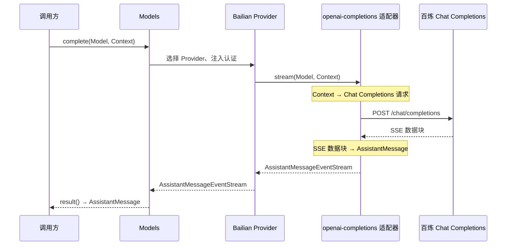

上一章已经能根据 `model.provider` 选择 Provider，但示例 Provider 只返回固定消息。本章把同一个调用入口接到阿里云百炼：读者将学会区分“选择哪家模型服务”和“使用哪种通信协议”，并用 pi 现有的协议实现完成一次真实模型请求。



去程中，适配器把统一输入转换成百炼请求；回程中，同一个适配器把百炼数据块还原为统一消息。Provider 只负责把选中的模型、认证信息和协议实现连接起来。

## 1. 协议适配器把统一调用翻译成厂商协议

Provider 决定请求发给哪家服务；协议适配决定双方如何交换数据。这是两个不同的选择：

```text
model.provider = "bailian"                       → Models 找到 Bailian Provider
model.api = "openai-completions"                 → 声明模型使用的通信协议
createProvider({ api: openAICompletionsApi() })   → 提供该协议的真实实现
```

这里的“协议适配”包含两个方向：

1. 把 pi 的 `Context` 转换成 Chat Completions 请求体；
2. 把服务端返回的 SSE 数据块累积成 pi 的 `AssistantMessage`。

可以把协议适配器理解为 Provider 与模型服务之间的转换层。Provider 把统一的 `Model`、`Context` 和请求参数交给它；它负责生成厂商请求、发送请求，再把厂商响应转换成统一事件。

为了让 Provider 能以相同方式调用不同协议，pi 把适配器的调用形式统一为：

```text
stream(Model, Context, 请求参数) → AssistantMessageEventStream
```

源码使用 `ProviderStreams` 表示这条规则。它固定了适配器的边界：输入始终是 pi 的模型与上下文，输出始终是 pi 的消息事件流。Provider 因此不需要知道不同厂商的 HTTP 请求和流式响应有什么差别。

`openAICompletionsApi()` 提供的就是 Chat Completions 协议对应的 `stream()` 实现。这个实现接收统一输入，完成前面所说的双向转换，再返回统一事件流；所以同一个适配器可以调用所有兼容 Chat Completions 的服务。

前两章已经使用过 `model.provider`，但没有展开 `model.api`。本章选择 `openai-completions`，是因为百炼提供与 Chat Completions 兼容的接口，而 pi 已经实现了这套请求和响应转换。

## 2. 用模型声明固定两级选择

这个 Provider 只调用 `qwen3.8-flash`，因此模型声明保持固定。下面是本章 Lab 使用的完整模型配置：

```ts
const model: Model<"openai-completions"> = {
	id: "qwen3.8-flash",
	name: "Qwen3.8 Flash",
	provider: "bailian",
	api: "openai-completions",
	baseUrl,
	reasoning: true,
	input: ["text", "image"],
	cost: { input: 0.8, output: 2.7, cacheRead: 0.1, cacheWrite: 1.25 },
	contextWindow: 1_000_000,
	maxTokens: 131_072,
	compat: {
		supportsStore: false,
		supportsDeveloperRole: false,
		supportsReasoningEffort: false,
		maxTokensField: "max_tokens",
		thinkingFormat: "qwen",
	},
};
```

`provider` 和 `api` 分别固定服务选择与协议选择。`baseUrl` 也必须保存在模型上，因为 pi 根据实际模型的地址创建请求客户端。

自定义 Provider 不会命中 pi 为其他厂商准备的自动兼容判断，所以 `compat` 明确关闭百炼文档没有定义的 `store` 和 `developer` 消息，并使用百炼支持的 `max_tokens` 字段。`reasoning: true` 记录模型支持思考模式；`thinkingFormat: "qwen"` 让适配器使用百炼的 `enable_thinking` 参数。本章调用没有传入 `reasoningEffort`，因此适配器发送 `enable_thinking: false`，仍然只获取普通文本回复。

## 3. 组装并注册 Bailian Provider

`createProvider()` 把地址、认证、模型目录和协议实现组合成一个 Provider：

```ts
const provider = createProvider({
	id: "bailian",
	name: "Alibaba Cloud Model Studio",
	baseUrl,
	auth: {
		apiKey: envApiKeyAuth("Bailian API key", ["DASHSCOPE_API_KEY"]),
	},
	models: [model],
	api: openAICompletionsApi(),
});

const models = createModels();
models.setProvider(provider);
```

`envApiKeyAuth()` 在请求发生时读取 `DASHSCOPE_API_KEY`。`api: openAICompletionsApi()` 把 Chat Completions 适配器绑定到这个 Provider。之后调用 `provider.stream()` 时，Provider 会把相同的 `model`、`context` 和请求参数交给适配器的 `stream()`；Provider 本身不处理 HTTP 请求或 SSE 响应。

注册后，调用方仍然使用第一章的统一入口：

```ts
const reply = await models.complete(model, context, { maxTokens: 128 });
```

这一次调用在 pi 源码中的主路径是：

```text
Models.complete()
  → Models.stream()
  → requireProvider(model.provider)
  → applyAuth()
  → provider.stream()
  → 协议适配器.stream()
  → eventStream.result()
```

`Models` 先找到 `bailian`，Bailian Provider 再把调用交给创建时绑定的 `openai-completions` 协议实现；`model.api` 与这个实现使用同一个协议标识。最终的 `result()` 等待数据流结束并返回完整 `AssistantMessage`。

## 4. 适配器如何完成双向转换

发送请求前，`buildParams()` 调用 `convertMessages()`，把统一上下文转换成 Chat Completions 参数。省略与本章无关的选项后，核心结构如下：

```ts
const messages = convertMessages(model, context, compat);
const params = {
	model: model.id,
	messages,
	stream: true,
	stream_options: { include_usage: true },
};
```

例如下面的输入：

```ts
const context: Context = {
	systemPrompt: "Answer briefly.",
	messages: [{ role: "user", content: "hello", timestamp: Date.now() }],
};
```

会产生下面的核心请求体：

```json
{
  "model": "qwen3.8-flash",
  "messages": [
    { "role": "system", "content": "Answer briefly." },
    { "role": "user", "content": "hello" }
  ],
  "max_tokens": 128,
  "enable_thinking": false,
  "stream": true,
  "stream_options": { "include_usage": true }
}
```

`timestamp` 是 pi 的消息字段，不属于 Chat Completions 请求，因此转换后不会出现。

百炼以 SSE（服务端逐块返回的文本数据流）返回结果。适配器把每个 `choice.delta.content` 追加到同一个文本块，并把 `finish_reason` 转换成统一结束原因：

```ts
if (choice.delta.content) {
	const block = ensureTextBlock();
	block.text += choice.delta.content;
	stream.push({ type: "text_delta", delta: choice.delta.content, partial: output });
}

if (choice.finish_reason) {
	output.stopReason = mapStopReason(choice.finish_reason).stopReason;
}
```

因此，调用方拿到的不是百炼原始数据块，而是包含完整文本、结束原因和 token 用量的 `AssistantMessage`。

## 5. 运行一次真实请求

完整程序在 `labs/03-bailian-provider.ts`。在项目根目录的 `.env` 中填写：

```dotenv
DASHSCOPE_API_KEY=你的百炼_API_Key
BAILIAN_BASE_URL=https://dashscope.aliyuncs.com/compatible-mode/v1
```

安装依赖并运行：

```bash
npm install
node labs/03-bailian-provider.ts
```

模型回复内容每次可能不同，成功输出的结构如下：

```text
qwen3.8-flash: <模型回复>
tokens: input=<输入 token>, output=<输出 token>, total=<总 token>
chapter 3 real call passed
```

Lab 直接调用 pi 的 `models.complete()`。它断言回复文本非空，并且数据流以 `stop` 或 `length` 结束；认证失败、模型不可用、网络错误或不完整的数据流都会使进程以错误退出。

## 6. 数据流必须有明确的结束原因

适配器收到流结束标记后，还会检查响应中是否出现过 `finish_reason`：

```ts
if (!hasFinishReason) {
	throw new Error("Stream ended without finish_reason");
}
```

这个检查保证 `models.complete()` 不会把意外中断的半条回复当成完整结果。它属于协议适配层，因为这一层负责判断 Chat Completions 响应是否完整。

## 7. 本章小结

本章接通了第一阶段的真实模型调用。读者现在可以：

- 用 `model.provider` 选择百炼服务，用 `model.api` 选择通信协议；
- 用 `createProvider()` 组合服务地址、认证、模型和现有协议实现；
- 通过 `models.complete()` 提交统一上下文，得到统一的 `AssistantMessage`；
- 运行 Lab 验证真实的百炼 HTTP/SSE 调用链。

对应源码：[`types.ts`](https://github.com/earendil-works/pi/blob/main/packages/ai/src/types.ts)、[`models.ts`](https://github.com/earendil-works/pi/blob/main/packages/ai/src/models.ts)、[`openai-completions.lazy.ts`](https://github.com/earendil-works/pi/blob/main/packages/ai/src/api/openai-completions.lazy.ts)、[`openai-completions.ts`](https://github.com/earendil-works/pi/blob/main/packages/ai/src/api/openai-completions.ts)。百炼请求参数和流式响应格式见[阿里云百炼 Chat Completions 文档](https://help.aliyun.com/zh/model-studio/qwen-api-via-openai-chat-completions)，模型能力与上下文限制见[`qwen3.8-flash` 模型信息](https://help.aliyun.com/zh/model-studio/qwen3-8-flash)。
