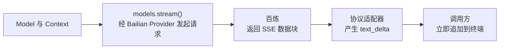

上一章已经接通百炼，但程序要等 `models.complete()` 返回后，才一次性打印整条回复。本章保留相同的模型配置和 Provider，把调用方改为接收文本分片：第一段文字到达时就显示，后面的文字继续追加。



图中的请求路径沿用第三章。本章只改变回复如何到达显示端；终端承担最小界面的作用，每次写入就能看到新增文字。

## 1. 每次收到的是新增文本，不是整条回复

“逐字显示”指的是回复持续出现。服务端每次可能返回一个字、几个词或一整段，调用方不能假定一个分片恰好对应一个字。

理解显示过程只需要以下几个概念：

| 概念 | 在本章中的含义 |
|---|---|
| 文本分片 `delta` | 这次新到达的字符串，只追加一次 |
| 文本块与 `contentIndex` | 回复的 `content` 数组中保存文本的位置；分片说明自己属于哪个块 |
| 当前消息 `partial` | 适配器正在累积的消息，包含已经写入的内容 |
| 异步迭代 `for await` | 按顺序取出事件；暂时没有事件时等待，有事件时执行循环体 |

pi 在 [`types.ts`](https://github.com/earendil-works/pi/blob/3fc3ef532b966b28b764af070d62302c0acab0d5/packages/ai/src/types.ts) 的 `AssistantMessageEvent` 中定义文本分片事件。下面摘出其中的 `text_delta` 成员；这是类型声明，描述事件的字段，不是一条实际响应：

```ts
{ type: "text_delta"; contentIndex: number; delta: string; partial: AssistantMessage }
```

假设服务端依次返回 `"你可以先"`、`"看到回复。"`，只含一个文本块时，数据变化如下：

| 到达的分片 | `contentIndex` | 适配器累积的文本 | 终端本次写入 |
|---|---|---|---|
| `你可以先` | `0` | `你可以先` | `你可以先` |
| `看到回复。` | `0` | `你可以先看到回复。` | `看到回复。` |

显示端追加的是 `delta`。如果把累积文本也当成新增文本追加，第二次就会重复打印第一段。

## 2. 让调用方直接取得事件流

第三章使用的 `complete()` 本来就是基于流实现的。下面是 [`models.ts`](https://github.com/earendil-works/pi/blob/3fc3ef532b966b28b764af070d62302c0acab0d5/packages/ai/src/models.ts) 中省略类型标注后的真实方法主体：

```ts
async complete(model, context, options) {
	return this.stream(model, context, options).result();
}
```

它发起流式请求，然后等待完整消息。要提前显示文字，调用方直接使用同一个 `stream()` 入口，并开始迭代：

```ts
const events = models.stream(model, context, { maxTokens: 256 });

for await (const event of events) {
	if (event.type === "text_delta") {
		process.stdout.write(event.delta);
	} else if (event.type === "error") {
		throw new Error(event.error.errorMessage ?? event.reason);
	}
}
```

这是调用方连续显示文本的最小写法，其中 `events` 是 pi 的统一事件流。`models.stream()` 立即返回事件流，认证和请求准备可以继续异步执行；`for await` 等待的是下一条事件，不是完整回复。`process.stdout.write()` 不会自动换行，因此多个分片会接成一段连续文字。

模型与 Provider 配置沿用第三章。

## 3. 适配器把服务端分片转换成文本事件

### 先创建消息和用于发送事件的对象

适配器需要两个对象：`output` 保存逐步累积的回复，`stream` 把处理过程中产生的事件交给调用方。下面摘自 [`openai-completions.ts` 的入口](https://github.com/earendil-works/pi/blob/3fc3ef532b966b28b764af070d62302c0acab0d5/packages/ai/src/api/openai-completions.ts#L306)，省略类型标注和其他消息字段，保留异步处理、响应循环及成功与失败分支的结构。方括号编号标出拆分位置，代码后的表格说明各片段在哪里展开：

```ts
export const stream = (model, context, options) => {
	const stream = new AssistantMessageEventStream();

	(async () => {
		const output = {
			role: "assistant",
			content: [],
			// 其他消息字段省略
		};
		try {
			// [1] 发起请求，取得 openaiStream
			// [2] 定义文本块变量和 ensureTextBlock()

			for await (const chunk of openaiStream) {
				// [3] 处理数据块、累积文本并发送 text_delta
			}

			// [4] 完成检查与成功事件
		} catch (error) {
			// [4] 整理错误信息并发送错误事件
		}
	})();

	return stream;
};
```

这些片段属于上面同一个异步函数，不是另外定义的函数入口：

| 入口中的片段 | 展开位置 |
|---|---|
| `[1]` 请求与 `openaiStream` 的来源 | 本节“从服务端数据块中取出新增文本”的开头 |
| `[2]` 文本块变量与 `ensureTextBlock()` | 下文“创建并复用本次回复的文本块” |
| `[3]` 响应循环及其循环体 | 本节“从服务端数据块中取出新增文本”中的响应循环 |
| `[4]` 循环后的完成处理，以及 `catch` 中的失败处理 | 第 4 节“已显示文字，还需要确认请求是否成功结束” |

外面的 `stream` 是适配器函数，内部的同名变量是事件流对象。函数启动异步处理后立即返回这个对象，内部循环继续通过 `stream.push(...)` 写入事件；调用方经 `models.stream()` 读取这些事件。

### 创建并复用本次回复的文本块

下面展开入口代码中的片段 `[2]`：它位于取得 `openaiStream` 之后、响应循环之前。

`output.content` 初始为空。第一次收到文本时，适配器向这个数组加入一个空文本块；之后每个分片都追加到同一个块里。下面的代码位于同一个异步函数内，省略了非文本内容处理，保留真实变量名和操作顺序：

```ts
let textBlock: TextContent | null = null;
const blocks = output.content as StreamingBlock[];
const getContentIndex = (block: StreamingBlock) => blocks.indexOf(block);

const ensureTextBlock = () => {
	if (!textBlock) {
		textBlock = { type: "text", text: "" };
		blocks.push(textBlock);
		stream.push({ type: "text_start", contentIndex: getContentIndex(textBlock), partial: output });
	}
	return textBlock;
};
```

这里的 `TextContent` 是前文消息中的 `{ type: "text", text: string }`，`StreamingBlock` 是适配器内部使用的内容块类型。`as StreamingBlock[]` 只作 TypeScript 类型断言，不会复制数组，所以 `blocks` 与 `output.content` 指向同一个数组。

第一次调用 `ensureTextBlock()` 时，`blocks.push(textBlock)` 把文本块对象放入消息；函数返回的也是这个对象。因此，后面修改返回值的 `text` 字段，就会改变 `output.content` 中的文本。`getContentIndex()` 查找该块在数组中的下标；本例的数组中只有这个文本块，下标就是 `0`。`text_start` 只通知文本块开始，不包含需要追加的文字。

### 从服务端数据块中取出新增文本

下面展开入口代码中的片段 `[1]` 和 `[3]`：先说明服务端数据流从哪里来，再展开读取它的循环。

第三章已经在请求中设置 `stream: true`。适配器通过 OpenAI SDK 发起 Chat Completions 请求，SDK 解码 SSE 响应后，提供一个可异步迭代的数据流。源码把 SDK 返回结果的 `data` 命名为 [`openaiStream`](https://github.com/earendil-works/pi/blob/3fc3ef532b966b28b764af070d62302c0acab0d5/packages/ai/src/api/openai-completions.ts#L350-L370)。它提供的是服务端数据块，还不是 pi 的统一事件。

例如，包含第一段文本的数据块可以是下面的形状，仅展示本章使用的字段：

```json
{
  "choices": [
    { "delta": { "content": "你可以先" } }
  ]
}
```

`choices` 保存这次返回的候选回复，当前适配器读取第一个。`choice.delta` 是一个对象，新增文本保存在其 `content` 字段中。第二段文本到达时，这个字段变成 `"看到回复。"`，其中不会带上第一段已经返回的文字。

下面展开入口标记 `[3]` 的响应循环及本章使用的循环体。它从 `openaiStream` 取出数据块，读取新增文本，再调用 `[2]` 中定义的 `ensureTextBlock()`。代码按真实控制顺序裁剪，省略非文本内容和统计字段处理：

```ts
for await (const chunk of openaiStream) {
	if (!chunk || typeof chunk !== "object") continue;

	const choice = Array.isArray(chunk.choices) ? chunk.choices[0] : undefined;
	if (!choice) continue;

	if (choice.delta) {
		if (
			choice.delta.content !== null &&
			choice.delta.content !== undefined &&
			choice.delta.content.length > 0
		) {
			const block = ensureTextBlock();
			block.text += choice.delta.content;
			stream.push({
				type: "text_delta",
				contentIndex: getContentIndex(block),
				delta: choice.delta.content,
				partial: output,
			});
		}
	}
}
```

每次非空文本到达，适配器先用 `block.text += choice.delta.content` 修改消息里的文本块，再通过 `stream.push()` 发送统一事件。处理第一段 `"你可以先"` 后，事件发送时的内容如下，仅展示消息中与文本相关的字段：

```json
{
  "type": "text_delta",
  "contentIndex": 0,
  "delta": "你可以先",
  "partial": {
    "content": [{ "type": "text", "text": "你可以先" }]
  }
}
```

这里的 `event.delta` 已经是字符串，来自服务端的 `choice.delta.content`。`partial` 引用正在更新的 `output`，不是独立保存的历史快照，不能作为新增文本重复追加。处理第二段后，`event.delta` 是 `"看到回复。"`，而消息里的文本变成 `"你可以先看到回复。"`。这正是第一节表格中“本次新增”和“已经累积”的区别。

### 把发送的事件交给读取方

`stream.push()` 把一条事件交给事件流，`for await` 从事件流中读取它。下面用同一个事件流对象 `stream` 示意这两个操作；`0` 和 `"你好"` 是示意值，假设 `output` 中的文本已经由适配器累积完成。两段代码分别表示发送端和读取端，不是完整请求程序：

```ts
// 适配器：交出这次新增的文本
stream.push({
	type: "text_delta",
	contentIndex: 0,
	delta: "你好",
	partial: output,
});

// 读取方：读到事件后显示文本
for await (const event of stream) {
	if (event.type === "text_delta") {
		process.stdout.write(event.delta);
	}
}
```

这条事件被读取后，终端显示 `你好`。[`EventStream.push()`](https://github.com/earendil-works/pi/blob/3fc3ef532b966b28b764af070d62302c0acab0d5/packages/ai/src/utils/event-stream.ts#L21-L36) 在读取方已经等待时直接交付事件，否则先存入队列，等读取方按顺序取出。`push()` 负责交付事件，文本的累积由前面的适配器代码完成，显示由读取方完成。

实际调用中，适配器与调用方持有的是内外两层事件流。适配器返回的事件流经由[第二章介绍的 `lazyStream()` 转发机制](../02-provider-routing/#等待认证时先把事件流交给调用方)逐条向调用方的 `events` 转发事件。第二节的循环每收到一个 `text_delta`，就立即把其中的新增字符串写到终端。

## 4. 已显示文字，还需要确认请求是否成功结束

`text_delta` 只说明有新增文本。请求可能在显示半句话后中断，因此不能把“有文字”当作成功依据。

下面展开第 3 节入口代码中的片段 `[4]`。成功分支位于 `for await` 循环之后，错误分支位于对应的 `catch` 中；两个分支不会依次执行。适配器在成功完成时产生 `done` 事件，失败时产生 `error` 事件。以下是 [`openai-completions.ts`](https://github.com/earendil-works/pi/blob/3fc3ef532b966b28b764af070d62302c0acab0d5/packages/ai/src/api/openai-completions.ts) 中两个分支各自的收尾代码，省略了前面的结束检查和错误信息整理：

```ts
// 成功分支
stream.push({ type: "done", reason: output.stopReason, message: output });
stream.end();

// catch 分支
stream.push({ type: "error", reason: output.stopReason, error: output });
stream.end();
```

`done` / `error` 告知调用方请求结果，适配器随后调用 `stream.end()` 完成事件流收尾。

## 5. 运行 Lab 并查看输出

完整程序在 `labs/04-streaming-text.ts`，沿用第三章的百炼配置，改为逐行打印收到的文本分片。

沿用第三章配置好的依赖和 `.env`，在项目根目录运行：

```bash
node labs/04-streaming-text.ts
```

输入固定为：

```text
用中文分三句话解释为什么流式回复能减少等待感。
```

下面是成功运行的输出示例，中间分片已省略，实际文本和分片数量会随响应变化：

```text
input: 用中文分三句话解释为什么流式回复能减少等待感。
model: qwen3.8-flash
delta 1: "流"
delta 2: "式回复通过逐"
delta 3: "字或"
...
delta 18: "感。"
text_delta events: 18
chapter 4 streaming passed
```

每行 `delta` 展示本次到达的文本；按序连接全部分片就是回复全文。`text_delta events` 是分片总数，最后的 `passed` 表示文本非空且完成检查通过。观察相邻几行，可以看到分片长度并不固定；一次回复也可能只包含一个分片。

## 6. 本章小结

现在，同一套百炼配置可以让文字随响应分片持续出现：适配器把服务端新增文本转换成统一事件，调用方每收到一段就追加到终端。显示过程不再等待整条回复，请求中途失败也能明确报错。

对应源码：[`types.ts`](https://github.com/earendil-works/pi/blob/3fc3ef532b966b28b764af070d62302c0acab0d5/packages/ai/src/types.ts)、[`models.ts`](https://github.com/earendil-works/pi/blob/3fc3ef532b966b28b764af070d62302c0acab0d5/packages/ai/src/models.ts)、[`openai-completions.ts`](https://github.com/earendil-works/pi/blob/3fc3ef532b966b28b764af070d62302c0acab0d5/packages/ai/src/api/openai-completions.ts)、[`lazy.ts`](https://github.com/earendil-works/pi/blob/3fc3ef532b966b28b764af070d62302c0acab0d5/packages/ai/src/api/lazy.ts)。
